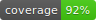

<!-- markdownlint-disable MD024 MD031 --> 

# Lithium for Angular (@lithiumjs/angular)

[](https://travis-ci.org/lVlyke/lithium-angular) [](./coverage/coverage.svg)

A decorator-based library for Angular that enables seamless reactive data binding using RxJS. Use Observables as first-class citizens in your view templates!

* [**Introduction**](#introduction)
* [**Installation**](#installation)
* [**Quick Start Guide**](/docs/intro-guide.md)
* [**AoT Compiler Guide**](/docs/aot-guide.md)
* [**API Reference**](/docs/api-reference.md)
* [**FAQ and Other Information**](#other-information)

## [Example app](https://github.com/lVlyke/lithium-angular-example-app) - [[Live demo]](https://lvlyke.github.io/lithium-angular-example-app)

## Introduction

Lithium is a decorator-based library for modern Angular applications that use reactive programming through RxJS. Lithium enables one-way and two-way binding of Observables and Subjects in view templates and allows them to be used just like regular synchronous variables. Lithium makes writing more performant components with [OnPush change detection](https://angular.io/api/core/ChangeDetectionStrategy) trivial with [AutoPush](/docs/intro-guide.md#autopush). Lithium is like ```async``` but better:

### Lithium vs ```AsyncPipe```

Angular has a built-in [async pipe](https://angular.io/api/common/AsyncPipe) that offers many similar features to Lithium. Lithium includes all of the benefits of ```async``` with additional features:

* **No syntax overhead** - Lithium allows you to treat reactive variables just like normal variables inside templates. There's no pipes to use, and things like nested properties can be accessed easily without [ugly workarounds](https://coryrylan.com/blog/angular-async-data-binding-with-ng-if-and-ng-else).
* **Reactive two-way binding support** - Lithium natively supports [two-way binding](https://angular.io/guide/template-syntax#two-way-binding---) of Subjects using ```[(ngModel)]``` and by direct template assignments (i.e. ```(click)="foo = 'bar'"```).
* **Reactive event binding support** - Unlike ```async```, Lithium supports reactive [event binding](https://angular.io/guide/template-syntax#event-binding). Click events, [lifecycle events](/docs/intro-guide.md#lifecycle-event-decorators), and more are Observables that can be subscribed to, instead of invoked as callback functions.
* **Works with Angular component decorators (```@Input```, ```@Output```, ```@HostListener``` and more)** - Lithium can be used to make reactive component inputs as Subjects and respond to host events through subscriptions to Observables with no syntax overhead.
* **Useful for directives** - Lithium's [AutoPush functionality](/docs/intro-guide.md#autopush) can be used with directives for easily writing OnPush-friendly directives.

Like ```async```, Lithium also has the following benefits:

* **Automatic subscription management** - Lithium will automatically end subscriptions when components are destroyed.
* **Simplified OnPush change detection** - Using AutoPush, Lithium makes writing [OnPush](https://angular.io/api/core/ChangeDetectionStrategy)-capable components trivial.
* **Full AoT compiler support** - Lithium supports AoT compilation. See [here](/docs/aot-guide.md) for more info.
* **Can be used with other reactive libraries** - Lithium has full compatability with other decorator-based libraries like [NGXS](https://github.com/ngxs/store).

Read through the [intro guide](/docs/intro-guide.md) to get to know Lithium's core features and view the [example app](https://github.com/lVlyke/lithium-angular-example-app) to see Lithium in action with real-world use-cases. Full [API](/docs/api-reference.md) documentation is also available.

## Installation

Lithium can be installed [via **npm**](https://www.npmjs.com/package/@lithiumjs/angular) using the following command:

```bash
npm install @lithiumjs/angular
```

## FAQ and Other information

### FAQ

#### Does Lithium support Angular's new view renderer, Ivy?

Yes, but you must use [Lithium 5.x.x](https://github.com/lVlyke/lithium-angular/blob/5.0.0/README.md#does-lithium-support-ivy) for full Ivy support.

### Other information

* [@lithiumjs/ngx-material-theming](https://github.com/lVlyke/lithium-ngx-material-theming)
* Lithium extensions for [Ionic](https://github.com/lVlyke/lithium-ionic).